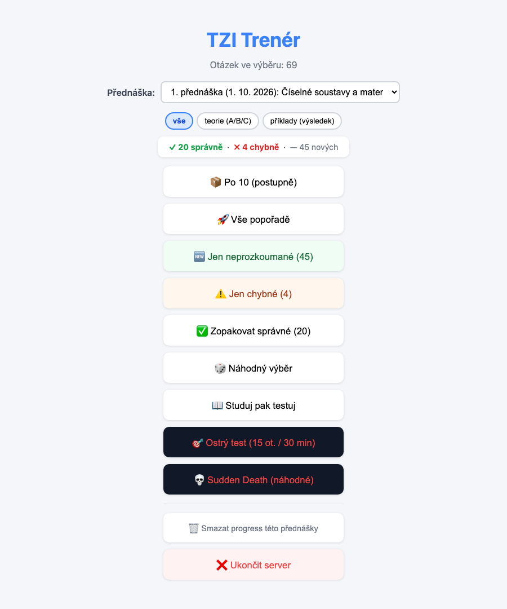
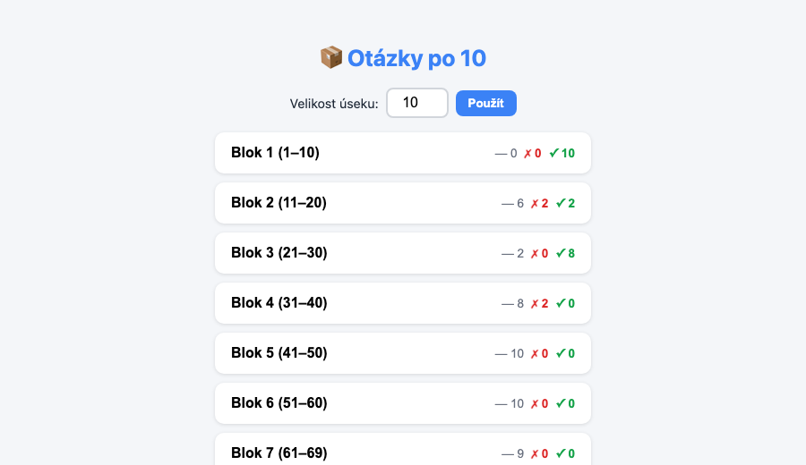
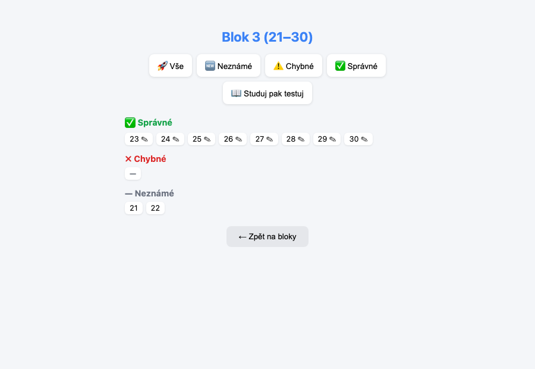
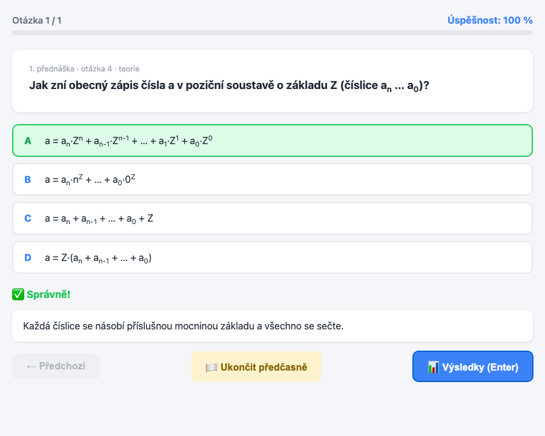
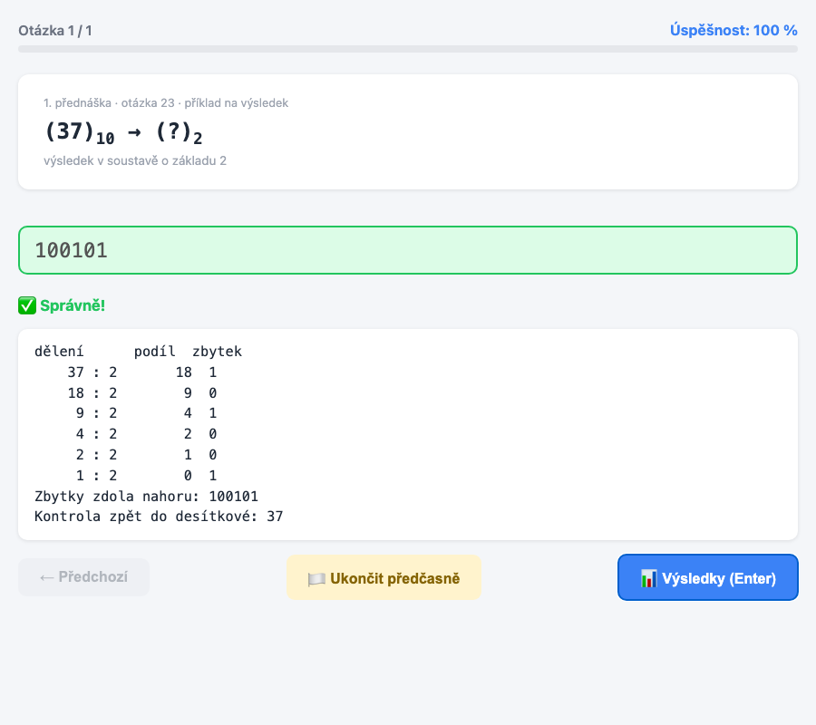
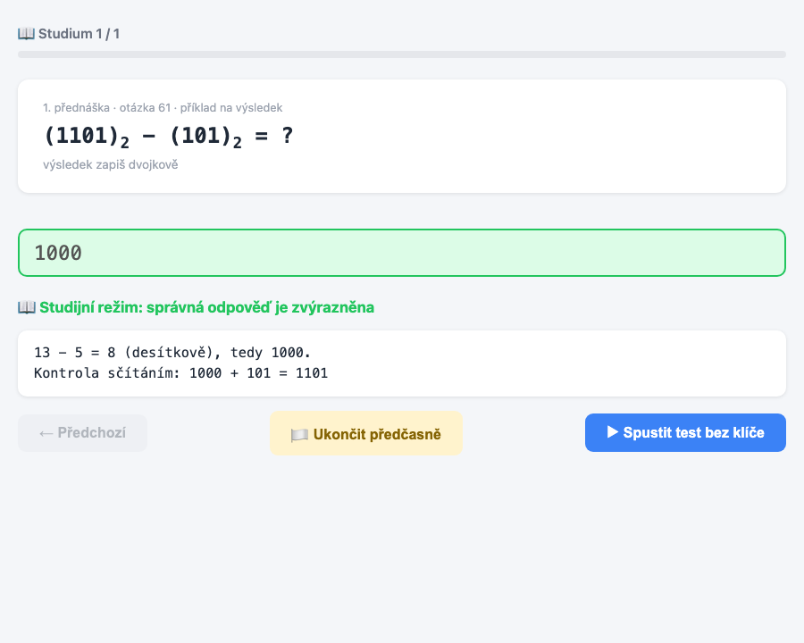
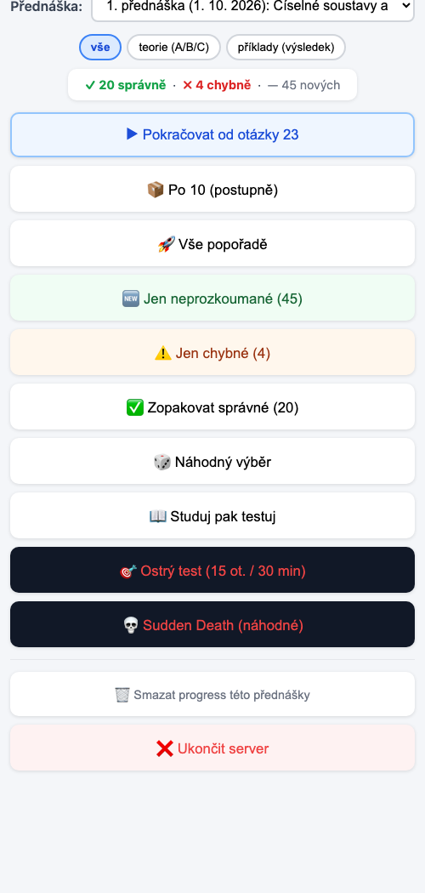
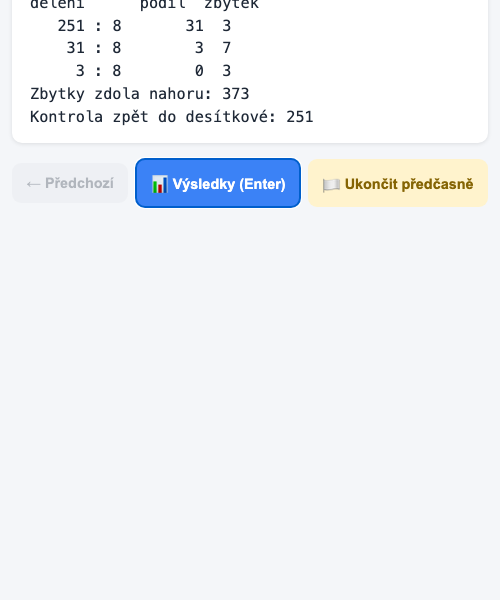

# TZI Trenér

> **Deklarace využití AI**
> Tento projekt (aplikaci, banky otázek a dokumentaci) vytvořil autor s pomocí nástroje **Claude Sonnet 5.5** (Anthropic, https://claude.ai, 2026). Obsah otázek vychází z autorových poznámek z přednášek KI/TIN. Správnost výpočetních příkladů je ověřena výpočtem, teoretické části doplněné AI je třeba kontrolovat proti sylabu předmětu.
> Uvedeno v souladu se Směrnicí rektora UJEP č. 7/2026 (pro studijní pomůcky povinné není, autor ji uvádí dobrovolně).

Kvíz na opakování přednášek z Teoretické informatiky (KI/TIN), stylem podobný [MTCNA-app](https://github.com/zdenax/MTCNA-app). Běží v prohlížeči, spouští se jedním `.py` souborem bez závislostí.

## Spuštění

```
python3 tzi_trener.py          # http://127.0.0.1:5051, otevře se prohlížeč
python3 tzi_trener.py --lan    # navíc dostupné v místní síti (telefon)
```

Stačí Python 3, nic se neinstaluje.

## Výběr přednášky

Nahoře v menu je rozbalovací seznam **Přednáška**. Každá přednáška má vlastní banku otázek (`banky/*.json`), v seznamu je její číslo, datum a téma. Je tam i volba **Všechny přednášky dohromady**. Dále se dá přepnout typ otázek: vše, teorie (výběr A/B/C/D) nebo příklady (zadáš výsledek).

## Režimy

| Režim | Co dělá |
|---|---|
| 📦 Po X (postupně) | Bloky po X otázkách, v bloku rozpad na správné/chybné/neznámé a výběr podmnožiny |
| 🚀 Vše popořadě | Celá banka od začátku |
| 🆕 Jen neprozkoumané | Otázky, na které jsi ještě neodpovídal |
| ⚠️ Jen chybné | Otázky, které jsi zodpověděl špatně |
| ✅ Zopakovat správné | Otázky, které máš správně |
| 🎲 Náhodný výběr | Zadáš počet |
| 📖 Studuj pak testuj | Nejdřív otázky s odpovědí a postupem, pak test |
| 🎯 Ostrý test | 15 otázek, 30 minut, orientačně 60 % na úspěch |
| 💀 Sudden Death | První chyba = konec |

Postup (správně/chybně) se ukládá do `progress.json`, nabídne se **Pokračovat od poslední otázky**. U příkladů se po odpovědi ukáže celý postup (tabulka dělení, rozvoj, skupiny bitů).

## Screenshoty

### Desktop

<table>
<tr>
<td align="center"><b>1. Hlavní menu</b><br></td>
<td align="center"><b>2. Bloky (Po 10)</b><br></td>
</tr>
<tr>
<td align="center"><b>3. Detail bloku</b><br></td>
<td align="center"><b>4. Teoretická otázka</b><br></td>
</tr>
<tr>
<td align="center"><b>5. Příklad s postupem</b><br></td>
<td align="center"><b>6. Studijní režim</b><br></td>
</tr>
</table>

### Mobil (`--lan`)

<table>
<tr>
<td align="center"><b>Menu</b><br></td>
<td align="center"><b>Příklad</b><br></td>
</tr>
</table>

## Banky otázek

Jedna přednáška = jeden soubor `banky/NN-RRRR-MM-DD.json`. Formát:

```json
{"title": "Téma", "lecture": 1, "date": "2026-10-01", "questions": [
  {"id": "1-1", "number": 1, "type": "choice", "text": "...",
   "options": {"A": "...", "B": "..."}, "correct": ["B"], "explanation": "..."},
  {"id": "1-30", "number": 30, "type": "input", "text": "(37)₁₀ → (?)₂",
   "hint": "...", "answer": "100101", "solution": "postup"}
]}
```

Banka první přednášky se generuje skriptem `build_bank.py`, který odpovědi i postupy počítá, takže jsou správně. Nová přednáška = nový soubor v `banky/`, aplikace ho najde sama.

## Licence

MIT, viz [LICENSE](LICENSE). Obsah vznikl s pomocí AI (Claude Sonnet 5.5, Anthropic) z mých poznámek z přednášek.
